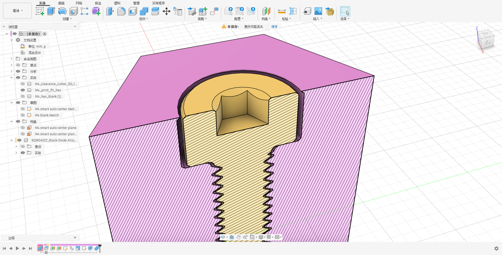
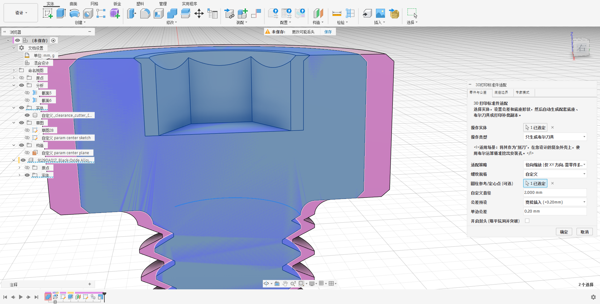
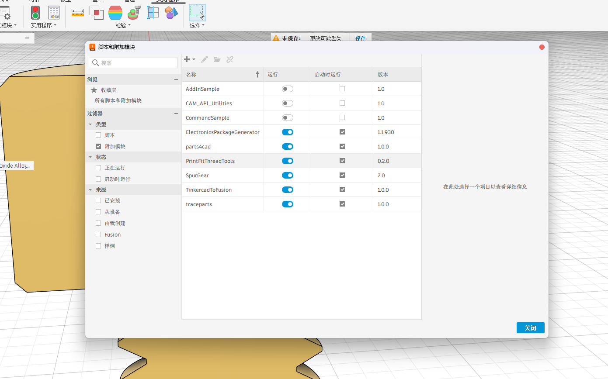
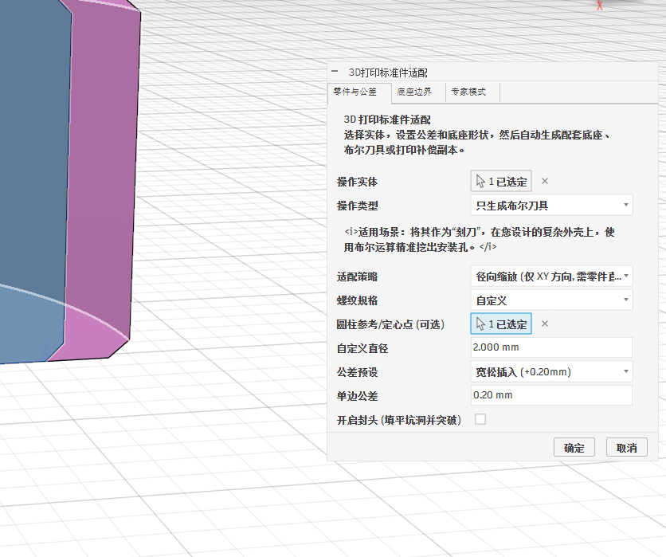

# PrintFitThreadTools 使用说明书

## 1. 简介
PrintFitThreadTools 是一款为 Fusion 360 开发的辅助插件。主要用于处理 McMaster-Carr 或其他渠道导入的标准件模型（如螺栓、螺母、轴承、齿轮等）。该插件能够根据设定的 3D 打印公差，自动生成相应的容纳底座、布尔切割刀具或补偿副本。

## 2. 功能特性

### 2.1 公差适配策略
系统提供三种计算策略以适应不同的几何类型：
- **径向缩放 (XY 方向)**：保持 Z 轴尺寸固定，仅在 XY 轴平面进行缩放。适用于螺纹等需要保持轴向间距（螺距）不变的部件。
- **等比缩放 (XYZ 方向)**：在 XYZ 三维方向进行均匀的比例放大。
- **面偏移 (法向等距)**：通过拓扑计算使零件表面沿法线方向向外偏移，适用于非对称或不规则形状的零件。

### 2.2 圆心基准提取
系统提供不完整几何体的特征圆心提取功能：
- **自动提取**：用户选中部分圆柱曲面时，系统自动提取该圆柱的几何中心作为缩放基准点。
- **手动指定**：支持通过点选圆弧边缘或顶点特征来手动设定中心基准。

### 2.3 封头与单向延伸
系统支持针对内六角或带有复杂倒角的螺丝头部生成延伸实体：
- **特征获取**：用户点选参照面后，系统获取螺丝头部的最大外接圆直径。
- **实体生成**：沿指定方向生成包含倒角的实心圆柱体延伸，并与刀具实体进行布尔合并。

### 2.4 参数作用域与性能控制
- **参数隔离**：多次操作同一零件时，系统会自动生成带数字后缀的独立用户参数（例如 `PF_M4_1_Clear`），防止不同操作之间的参数冲突。
- **预览降级**：在参数调整阶段，系统对高面数模型跳过布尔运算，生成的底座显示为 30% 半透明状态；确认操作后执行最终布尔切除计算。

## 3. 安装步骤

1. 将本仓库克隆或下载至本地计算机。
2. 启动 Fusion 360。
3. 依次点击顶部菜单栏：`实用程序 (Utilities)` -> `附加模块 (Add-ins)`。
4. 在弹出的对话框中，选择 `插件 (Add-ins)` 选项卡。
5. 点击绿色的 `+` 按钮，定位并选择本仓库下的 `PrintFitThreadTools` 文件夹。
6. 在加载项列表中选中 `PrintFitThreadTools`，勾选 `启动时运行 (Run on Startup)`，然后点击 `运行 (Run)`。

## 4. 操作说明

1. **选择对象**：在工作区视图中，选中需要处理的导入实体模型。
2. **启动插件**：通过工具栏入口调出插件面板。
3. **选择策略**：根据当前选中的模型类型，在面板中选择相应的适配策略（径向、等比或面偏移）。
4. **设置公差**：在公差设置项中输入所需的补偿数值，或选择系统预设值。
5. **配置底座**：选择外部底座的几何形状（如方块、六角、圆柱等），并输入所需的边距参数。
6. **执行操作**：点击确定按钮，系统将以参数化特征的形式在时间轴中生成结果。

## 5. 高级配置 (专家模式)

在插件面板的“专家模式”选项卡下，支持以下配置：
- 支持为 X、Y、Z 三个轴向分别输入独立的公差补偿数值。
- 支持禁用底座生成与布尔运算，仅输出计算后的实体刀具模型。
- 支持手动输入数值以覆盖全局的缩放比例或高度参数。

## 6. 版本记录

### v1.1.2
- CI/CD：修复 GitHub Actions 自动打包发布时缺失 `write` 权限的问题。

### v1.1.1
- 增加自动化构建：接入 GitHub Actions 自动发布流程。
- 文档更新：重构使用说明书，更新界面截图与功能描述。

### v1.1.0
- 功能优化：重构封头功能操作流程，移除深度与方向的手动选择步骤。
- 操作变更：支持通过点选参考面并输入延伸长度，自动生成封头延伸实体。
- 逻辑新增：增加模型朝向的自动判定功能。
- 特征处理：封头实体生成后自动与主模型执行布尔合并。

### v1.0.0
- 初始版本：发布全参数化公差生成基础功能。
- 核心功能：加入几何定心算法、参数作用域隔离与预览期布尔运算降级机制。
