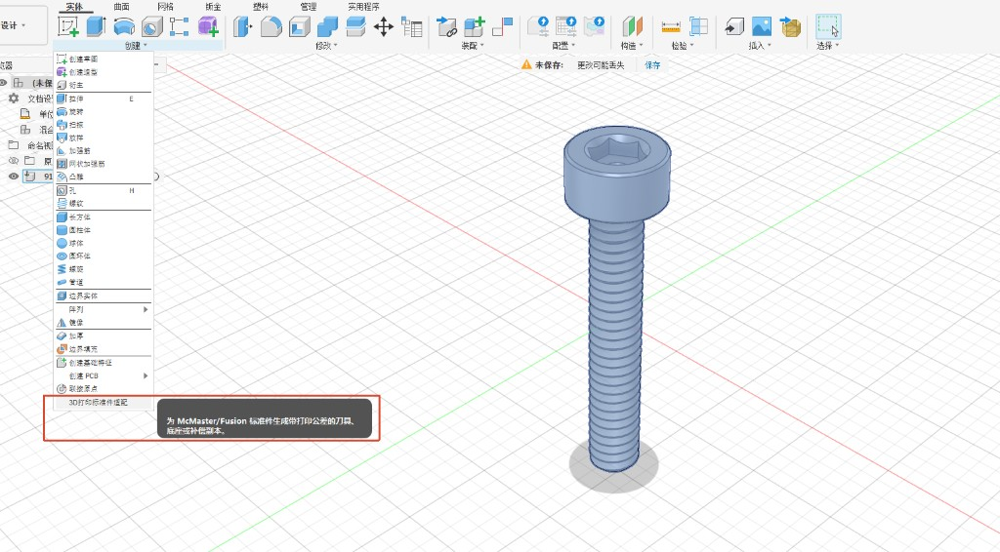
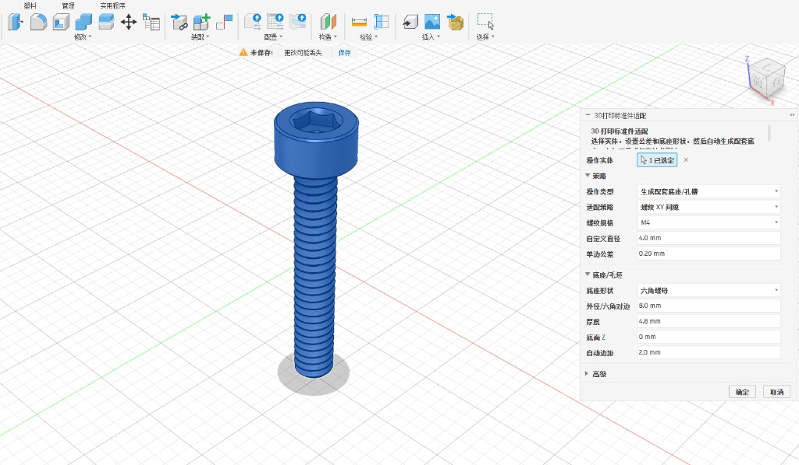
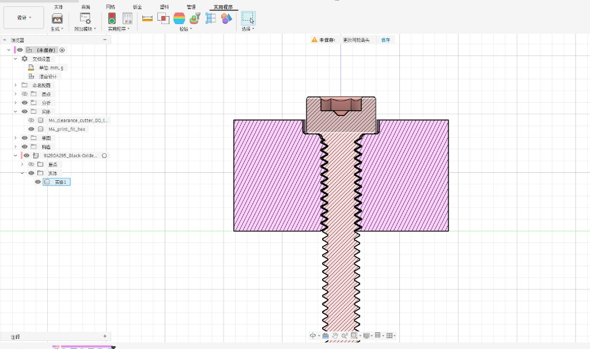

<div align="center">

# 3D 打印标准件适配 · Print-Fit Standard Parts Adapter

**Fusion 360 插件 — 为 McMaster / Fusion 标准件自动生成带打印公差的刀具、底座与补偿副本**

[](https://www.autodesk.com/products/fusion-360)
[](https://www.python.org/)
[]()
[](LICENSE)

[中文](#中文) · [English](#english)

</div>

---

## 预览 · Preview

<table>
  <tr>
    <td align="center" width="33%">
      <a href="docs/images/menu-entry.png">
        
      </a>
      <br/><sub><b>① 菜单入口</b> · Menu Entry</sub>
    </td>
    <td align="center" width="33%">
      <a href="docs/images/parameter-panel.png">
        
      </a>
      <br/><sub><b>② 参数面板</b> · Parameter Panel</sub>
    </td>
    <td align="center" width="33%">
      <a href="docs/images/section-fit-result.png">
        
      </a>
      <br/><sub><b>③ 剖面配合</b> · Section Fit Result</sub>
    </td>
  </tr>
</table>

> 选中标准件实体 → 设置公差与底座形状 → 自动生成带打印间隙的刀具、底座或补偿副本。  
> Select a standard-part body → set clearance & base shape → auto-generate print-fit cutters, bases, or adjusted copies.

---

<a id="中文"></a>

## 中文

### 简介

这套工具的目标不是只处理螺丝，而是把 **McMaster-Carr / Fusion 导入的标准件模型** 转成更适合 3D 打印装配的几何体：

- 选中实体，设置公差和底座形状
- 自动生成**放大刀具**、**配套底座/孔位**，或**尺寸补偿的打印副本**
- 不直接修改原始 McMaster / 标准件模型（通过复制体操作）

### 适用场景

| 场景 | 示例 |
| --- | --- |
| 螺纹配合 | 螺丝生成带间隙的螺母或螺纹底座 |
| 平面间隙 | 齿轮、皮带轮、轴套、滑块生成可装配的包络孔 |
| 安装定位 | McMaster 标准件快速生成安装座、定位座、避让槽 |
| 过紧零件 | 拖链、铰链、卡扣等生成缩小/放大的打印补偿副本 |

### 快速开始

#### 1. 安装插件

1. 克隆本仓库到本地
2. 打开 **Fusion 360**
3. 进入 **工具 → 脚本和加载项**
4. 在 **我的加载项** 中添加 `fusion/PrintFitThreadTools` 文件夹
5. 启用加载项并重启 Fusion 360（如提示）

#### 2. 运行工具

1. 在设计环境中选中一个或多个 **实体 Body**
2. 打开 **创建** 菜单，点击 **「3D打印标准件适配」**
3. 在右侧参数面板中设置策略与公差，点击 **确定**


> 上图示例：选中 M4 内六角螺丝，使用「螺纹 XY 间隙」策略，单边公差 0.20 mm，生成六角螺母底座。

#### 3. 查看结果

脚本会生成带 `DO_NOT_PRINT` 标记的刀具体，以及可直接打印的底座/孔位。剖面分析可验证螺纹间隙与配合效果：


### 三种操作模式

| 模式 | `operation` | 说明 |
| --- | --- | --- |
| 生成配套底座/孔槽 | `cavity` | 生成底座/毛坯，并用放大的刀具体自动布尔切割 |
| 只生成布尔刀具 | `tool` | 仅生成放大刀具，可手动用于切割任意模型 |
| 生成打印补偿副本 | `part` | 生成原零件的打印补偿副本，不创建底座、不布尔 |

### 四种适配策略

| 策略 | `fit` | 说明 |
| --- | --- | --- |
| 螺纹 XY 间隙 | `thread` | 螺丝/螺纹专用。只放大 X/Y，Z 固定 1.0，避免螺距变化 |
| 通用 XY 包络 | `xy` | 齿轮、轴套、滑块等。按包围盒中心放大 X/Y，Z 固定 1.0 |
| 通用 XYZ 包络 | `xyz` | 完整三维包络。X/Y/Z 都按间隙放大，适合避让槽、收纳座 |
| 手动缩放 | `manual` | 用 `scale_x/y/z` 或 `scale_xy` 手动指定比例 |

### 参数示例

**螺丝 → 六角螺母底座**

```text
operation=cavity; fit=thread; preset=M4; clearance=0.20; blank=hex; outer=8; thickness=4.8; z_start=0
```

**齿轮/皮带轮 → 矩形底座孔**

```text
operation=cavity; fit=xy; clearance=0.25; blank=box; margin=2
```

**McMaster 标准件 → 完整包络避让槽**

```text
operation=cavity; fit=xyz; clearance=0.30; blank=box; margin=2
```

**只生成放大刀具**

```text
operation=tool; fit=xy; clearance=0.25
```

**过紧零件 → 缩小打印副本**

```text
operation=part; fit=xyz; fit_adjust=-0.10
```

### 常用参数

| 参数 | 说明 |
| --- | --- |
| `clearance` | 单边间隙（mm） |
| `clearance_x/y/z` | 分轴间隙 |
| `blank` | 底座形状：`hex` / `cylinder` / `box` / `none` |
| `outer` | 六角对边或圆柱直径；不填时自动估算 |
| `thickness` / `z_start` | 底座厚度与底面 Z |
| `margin` | 自动底座在刀具外的额外边距（mm） |
| `preset` | 螺纹预设：`M2` ~ `M10` |
| `diameter` | 自定义螺纹公称/实测大径 |

### 螺纹 XY 缩放公式

```text
XY 缩放比例 = (公称直径 + 2 × 单边间隙) / 公称直径
Z 缩放比例 = 1.0
```

默认单边间隙 `0.20 mm`：

| 规格 | 公称直径 (mm) | XY 缩放 |
| --- | --- | --- |
| M2 | 2.0 | 1.200000 |
| M2.5 | 2.5 | 1.160000 |
| M3 | 3.0 | 1.133333 |
| M4 | 4.0 | 1.100000 |
| M5 | 5.0 | 1.080000 |
| M6 | 6.0 | 1.066667 |

本地计算缩放表：

```powershell
python tools/clearance_table.py --clearance 0.2 M2 M2.5 M3 M4 M5 M6
```

### 调参建议

- **装不上** → 增大 `clearance`，或改用 `fit=xyz`
- **太松** → 减小 `clearance`
- **齿轮/轴类孔位** → 优先 `fit=xy`，避免厚度方向变化
- **螺纹** → 固定用 `fit=thread`，不要用 `fit=xyz`
- **拖链/铰链** → 先用 `operation=part; fit=xyz; fit_adjust=-0.05` ~ `-0.15` 试印

### 注意事项

- 刀具体名称带 `DO_NOT_PRINT`，**不要打印**
- 选中的实体必须是 **BRep 实体**；STL/OBJ 网格需先转换
- `fit=thread` 默认缩放中心为根组件原点，螺丝轴线须在原点
- `fit=xy/xyz` 默认按包围盒中心缩放，不要求模型在原点

### 项目结构

```
├── fusion/PrintFitThreadTools/   # Fusion 360 插件入口
│   ├── PrintFitThreadTools.py
│   └── lib/threadfit_core.py     # 参数解析、公差与策略计算
├── config/metric_presets.json    # 公制粗牙规格默认参数
├── tools/clearance_table.py      # 本地螺纹 XY 缩放表计算
├── docs/principles.md            # 原理、策略边界与避坑记录
└── tests/test_threadfit_core.py  # 单元测试
```

更多原理说明见 [docs/principles.md](docs/principles.md)。

### 开源许可

本项目采用 [GPL-3.0 License](LICENSE) 开源。

你可以自由使用、修改和分发本软件，但在分发修改后的版本或基于本软件的衍生项目时，必须同样以 GPL-3.0 协议开源，并保留原始版权声明。软件按「原样」提供，不提供任何明示或暗示的担保。

---

<a id="english"></a>

## English

### Overview

This Fusion 360 add-in adapts **McMaster-Carr / Fusion imported standard-part bodies** for 3D-printed assemblies — not just screws, but gears, bushings, sliders, drag chains, hinges, and more.

**Workflow:** select body → set clearance & base shape → auto-generate enlarged cutters, matching bases/cavities, or dimension-adjusted printable copies. Original models are never modified directly.

### Use Cases

| Scenario | Example |
| --- | --- |
| Threaded fit | Generate clearance nuts or threaded bases for screws |
| Planar clearance | Envelope holes for gears, pulleys, bushings, sliders |
| Mounting & clearance | Quick install seats, locating bases, relief pockets for McMaster parts |
| Tight-fit parts | Scaled printable copies for drag chains, hinges, clips |

### Quick Start

#### 1. Install the Add-in

1. Clone this repository
2. Open **Fusion 360**
3. Go to **Tools → Add-Ins and Scripts**
4. Add the `fusion/PrintFitThreadTools` folder under **My Add-Ins**
5. Enable the add-in and restart Fusion 360 if prompted

#### 2. Run the Tool

1. Select one or more solid **Bodies** in the design
2. Open the **Create** menu and click **「3D打印标准件适配」** (Print-Fit Standard Parts Adapter)
3. Configure strategy and clearance in the panel, then click **OK**


> Example: M4 socket head cap screw, `thread` strategy, 0.20 mm single-side clearance, hex nut base.

#### 3. Review Results

The script creates cutters tagged `DO_NOT_PRINT` and printable bases/cavities. Use section analysis to verify thread clearance and fit:


### Operation Modes

| Mode | `operation` | Description |
| --- | --- | --- |
| Generate base/cavity | `cavity` | Create a blank and boolean-cut with an enlarged cutter |
| Cutter only | `tool` | Generate enlarged cutter only for manual boolean ops |
| Adjusted copy | `part` | Create a print-compensated copy; no base, no boolean |

### Fit Strategies

| Strategy | `fit` | Description |
| --- | --- | --- |
| Thread XY clearance | `thread` | Screws/threads only. Scale X/Y, Z = 1.0 to preserve pitch |
| Generic XY envelope | `xy` | Gears, bushings, sliders. Scale X/Y around bbox center, Z = 1.0 |
| Generic XYZ envelope | `xyz` | Full 3D envelope for relief pockets and mounting seats |
| Manual scale | `manual` | Set `scale_x/y/z` or `scale_xy` manually |

### Parameter Examples

**Screw → hex nut base**

```text
operation=cavity; fit=thread; preset=M4; clearance=0.20; blank=hex; outer=8; thickness=4.8; z_start=0
```

**Gear/pulley → rectangular base hole**

```text
operation=cavity; fit=xy; clearance=0.25; blank=box; margin=2
```

**McMaster part → full envelope relief**

```text
operation=cavity; fit=xyz; clearance=0.30; blank=box; margin=2
```

**Cutter only**

```text
operation=tool; fit=xy; clearance=0.25
```

**Tight part → shrunk printable copy**

```text
operation=part; fit=xyz; fit_adjust=-0.10
```

### Common Parameters

| Parameter | Description |
| --- | --- |
| `clearance` | Single-side clearance (mm) |
| `clearance_x/y/z` | Per-axis clearance |
| `blank` | Base shape: `hex` / `cylinder` / `box` / `none` |
| `outer` | Hex flat-to-flat or cylinder diameter; auto-estimated if omitted |
| `thickness` / `z_start` | Base thickness and bottom Z |
| `margin` | Extra margin around cutter for auto bases (mm) |
| `preset` | Thread preset: `M2` ~ `M10` |
| `diameter` | Custom thread nominal/measured major diameter |

### Thread XY Scale Formula

```text
XY scale = (nominal diameter + 2 × single-side clearance) / nominal diameter
Z scale = 1.0
```

Default single-side clearance `0.20 mm`:

| Size | Nominal Ø (mm) | XY Scale |
| --- | --- | --- |
| M2 | 2.0 | 1.200000 |
| M2.5 | 2.5 | 1.160000 |
| M3 | 3.0 | 1.133333 |
| M4 | 4.0 | 1.100000 |
| M5 | 5.0 | 1.080000 |
| M6 | 6.0 | 1.066667 |

Compute locally:

```powershell
python tools/clearance_table.py --clearance 0.2 M2 M2.5 M3 M4 M5 M6
```

### Tuning Tips

- **Too tight** → increase `clearance`, or switch to `fit=xyz`
- **Too loose** → decrease `clearance`
- **Gear/shaft holes** → prefer `fit=xy` to avoid thickness changes
- **Threads** → always use `fit=thread`, not `fit=xyz`
- **Drag chains/hinges** → try `operation=part; fit=xyz; fit_adjust=-0.05` to `-0.15`

### Notes

- Cutters are tagged `DO_NOT_PRINT` — **do not print them**
- Selected bodies must be **BRep solids**; convert STL/OBJ meshes first
- `fit=thread` scales around the root origin; screw axis must be at origin
- `fit=xy/xyz` scales around the body bounding-box center

### Project Structure

```
├── fusion/PrintFitThreadTools/   # Fusion 360 add-in entry
│   ├── PrintFitThreadTools.py
│   └── lib/threadfit_core.py     # Params, clearance & strategy logic
├── config/metric_presets.json    # Metric coarse-thread defaults
├── tools/clearance_table.py      # Local thread XY scale calculator
├── docs/principles.md            # Design principles & caveats
└── tests/test_threadfit_core.py  # Unit tests
```

See [docs/principles.md](docs/principles.md) for detailed design notes.

### License

This project is licensed under the [GPL-3.0 License](LICENSE).

You may use, modify, and distribute this software freely. Any modifications or derivative works must be distributed under the same GPL-3.0 license. The software is provided "as is", without warranty of any kind.

---

<div align="center">

<sub>Made for makers who print plastic parts and assemble with real hardware.</sub>

<br/><sub>© 2026 Roxy-DD · GPL-3.0 License</sub>

</div>
